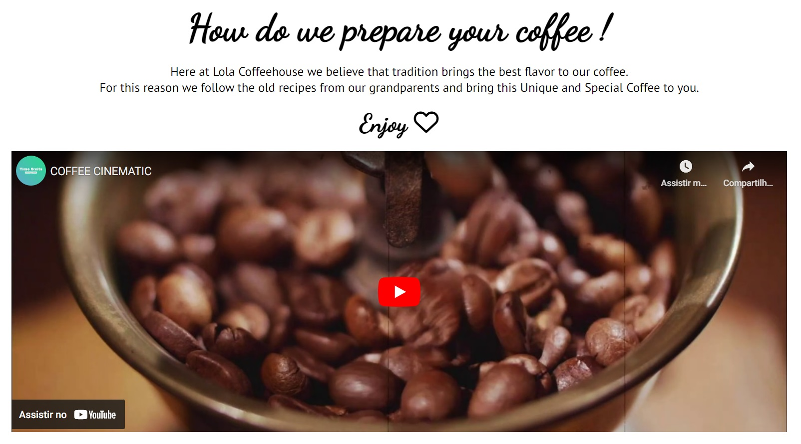
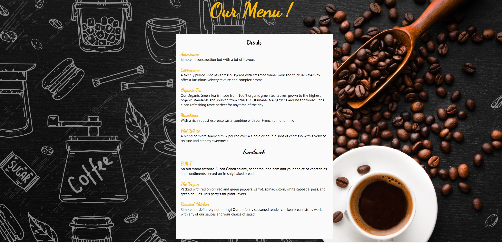

# Lola Coffeehouse
The Lola Coffeehouse website is a landing page for anybody who is looking for a excellent coffee and  sandwichs with a nice envirioment in Dublin area.

Users of this website will be able to find all the information they need to know about Lola Coffeehouse opening hours, menu, location and several promotions offered on the website.

# Features of Home Page

<h2>The Header</h2>
 
<ul>
    <li>
        
Feature at the top of the page, the naviagtion shows the coffeehouse name in the left corner:Lola Coffeehouse that links to the home page.

    </li>
    <li>
        
The other navigation links are to the right: Home, Menu, Location, Sign up.

    </li>
    <li>
        
Home, Menu, Location, has a hoover style that underlines the page the user is on.

    </li>
    <li>
        
The navigation clearly tells the user the name of the coffeehouse and website and makes the different sections of information easy to find.

    </li>
</ul>

<h2>The Welcome Section</h2>
 
<ul>
    <li>
        
Shows a lovely image from one of the tables from  coffeehouse that gives warm and welcoming feeling to the users of the website.
  
    </li>
    <li>
        
Cover on the right side of the image with the text "Made with love for you" with the font Dancing Script in a color that catch h the attention of the user.

    </li>
</ul>

 <h2>Why should you visit us? Section</h2>
 
<ul>
    <li>
        
The "Why should you visit us?" section gives details about what the coffeehouse offers to their customers.
  
    </li>
    <li>
        
The Easy Location, Friendly Envirioment and Monthly Discounts of this section have links inside of each of them that guide the users to other pages and give more information in the detail about each subject selected

    </li>
     <li>
        
The central picture in this section shows one the tables of the coffeehouse with friends having coffee together. Suggesting to the user friendly envirioment, one that the user may consider bring his friends to it. 

    </li>
</ul>

 
<h2>How do we prepare your coffee! Section</h2>
<ul>
    <li>
        
The "How do we prepare your coffee" describe to users that Lola Coffeehouse use a differente way to make coffee. One that is more unique and special.
  
    </li>
    <li>
        
The video in this section show in the details how unique is the coffee made at Lola Coffeehouse and why the coffee flavour is so special.

    </li>
</ul>

 
<h2>Social media Section</h2>
<ul>
    <li>
        
The has the Symbols from Facebook, Instagran and Twitter and all of them are linked with Lola Coffeehouse respective social media pages.
  
    </li>
    <li>
        
All the 3 Symbols have a hoover style so if the user has the arrow from the mouse pad on top of it the symbol will change color, giving the impression that the symbol is active and is functional to the user

    </li>
</ul>

 

# Features of Menu Page

<h2>Menu Page</h2>
 
<ul>
    <li>
        
It has same head and footer from the Home page

    </li>
    <li>
        
Simple and beautifull designed with background image that reminds the coffeehouse envirioment, with all the menu described and centralised in the webpage.

    </li>
    <li>
        
Name of drinks and sandwiches highlighted with Dancing Script font and with a shade of yellow.

    </li>
    <li>
        
All the items on the menu are described below their names so the user can understand how each item is made

    </li>
</ul>

 