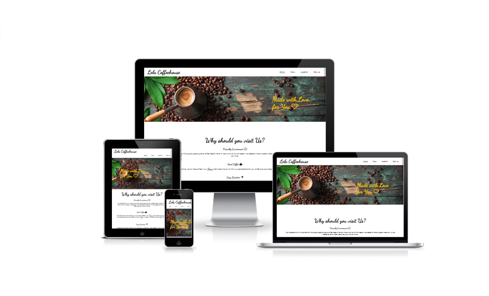
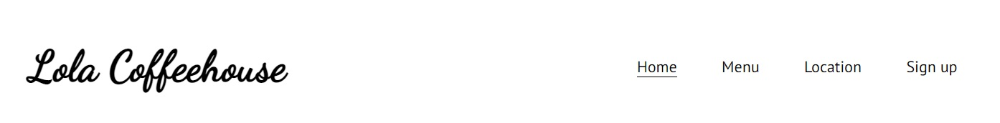
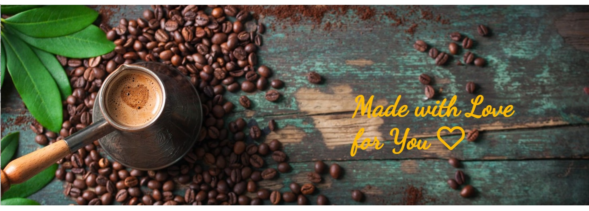
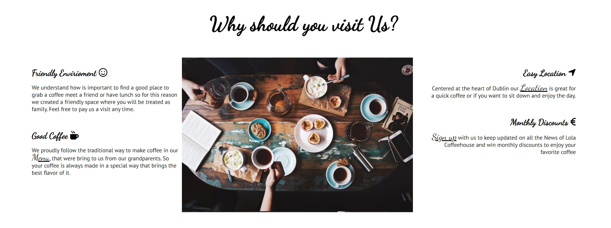

# Lola Coffeehouse
The Lola Coffeehouse website is a landing page for anybody who is looking for a excellent coffee and  sandwichs with a nice envirioment in Dublin area.

Users of this website will be able to find all the information they need to know about Lola Coffeehouse opening hours, menu, location and several promotions offered on the website.

# Features

<h2>The Header</h2>
 
<ul>
    <li>
        
Feature at the top of the page, the naviagtion shows the coffeehouse name in the left corner:Lola Coffeehouse that links to the home page.
    </li>
    <li>
        
The other navigation links are to the right: Home, Menu, Location, Sign up.
    </li>
    <li>
        
The navigation clearly tells the user the name of the coffeehouse and website and makes the different sections of information easy to find.
    </li>
</ul>

<h2>The Welcome Section</h2>
 
<ul>
    <li>
        
Shows a lovely image from one of the tables from  coffeehouse that gives warm and welcoming feeling to the users of the website.
  
    </li>
    <li>
        
Cover on the right side of the image with the text "Made with love for you" with the font Dancing Script in a color that catch h the attention of the user.

    </li>
</ul>

<h2>Why should you visit us? Section<h2>
<ul>
    <li>
        
The "Why should you visit us?" sectiongives details about what the coffeehouse offers to their customers.
  
    </li>
    <li>
        
The Easy Location, Friendly Envirioment and Monthly Discounts of this section have links inside of each of them that guide the users to other pages and give more information in the detail about each subject selected

    </li>
     <li>
        
The central picture in this section shows one the tables of the coffeehouse with friends having coffee together. Suggesting to the user friendly envirioment, one that the user may consider bring his friends to it. 

    </li>
</ul>

 